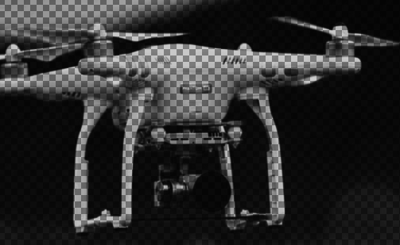

** Raster to svg *******  
** 将图片转换成svg格式 ***   lucas1jorge

Replace "raster.png" on line 15 with the name of your raster image

Set the scale on line 25. Smaller scale means smaller radius of the vector spheres (replacing pixels), and thus leads to better definition:

↓ scale - definition ↑

 

<b>Raster:</b>   

 

<b>svg:</b>   

